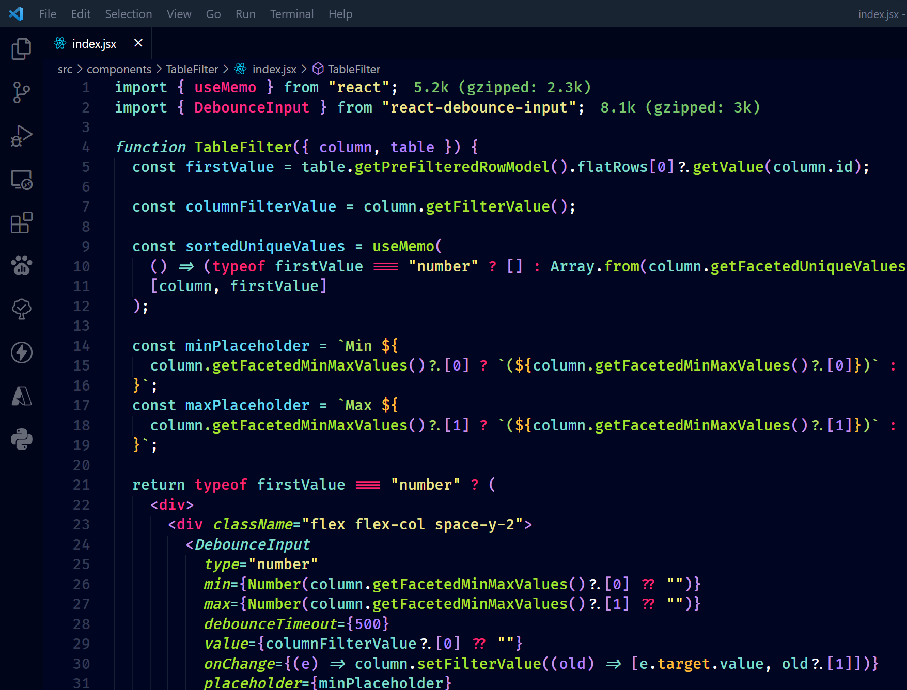

# Myth Theme

------------

## Awesome Theme for awesome people

Myth Theme is an awesome VS Code theme for the awesome community! It's lovable, it's breath-taking, it's the most powerful theme ever created!
Myth theme is blazingly awesome! Monakai younger, sexier brother😉😉.

Myth will make coding more fun, and it also comes with a dark mode to save your eyes at night.

➡️ How to install MYTH for Visual Studio Code:

```bash
1. Extensions ‣ Search for 'Myth Theme' ‣ Install
2. Command Palette ‣ Monokai Pro: select theme
```

How pretty:

